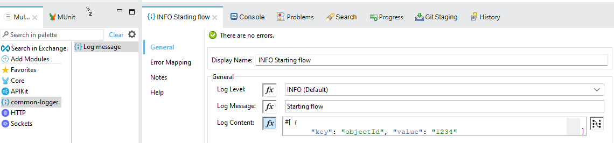
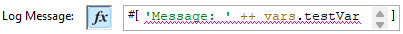
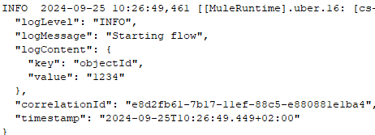

# Common Logger
A logger for Mule applications that logs a message, some content (optional) and the correlation id.

## Dependency
The logger could be a common dependency in the parent POM for ease of maintenance.
```
		<dependency>
			<groupId>org.mule.connectors</groupId>
			<artifactId>common-logger</artifactId>
			<version>1.0.0</version>
			<classifier>mule-plugin</classifier>
		</dependency>
```
## Usage
Use the logger by choosing the connector **common-logger - Log message** and insert message and optionally some content.



### Concatenate strings
Concatenate strings in formula mode:

 

Not in text mode:

 


## Output
Example:

